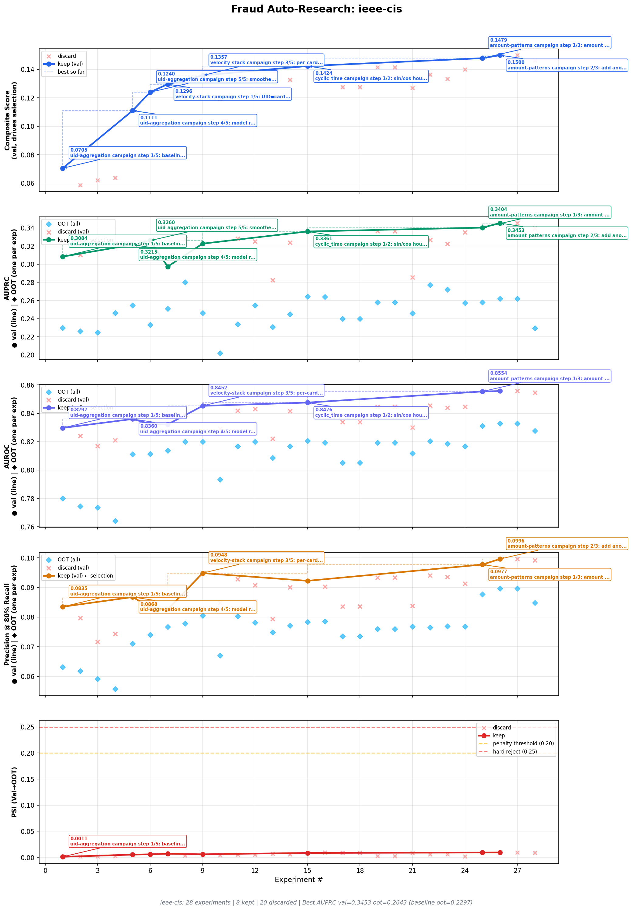
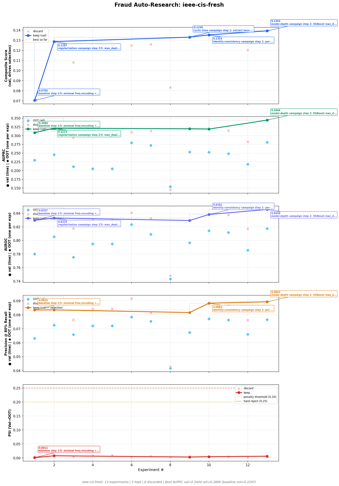
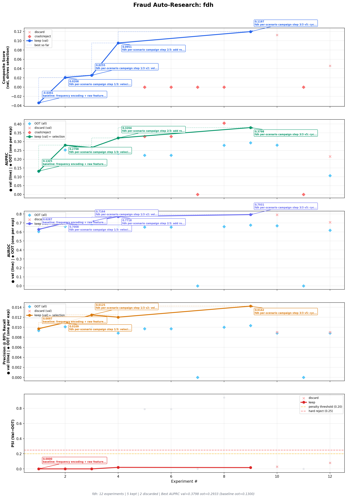
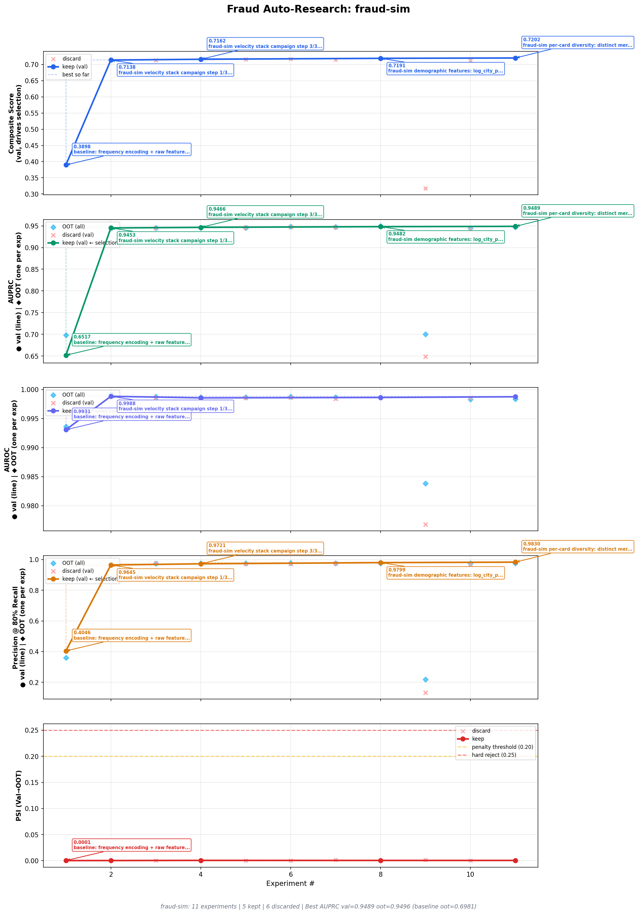

# fraud-auto-research

Autonomous feature engineering and model evaluation for transaction fraud monitoring, inspired by [Karpathy's autoresearch](https://github.com/karpathy/autoresearch). An LLM agent proposes hypotheses, implements features, evaluates results, and iterates — the harness just keeps score.

---

## Live Results

**[→ View full dashboard](https://nockbarry.github.io/fraud-auto-research/reports/dashboard.html)**

| Dataset | Experiments | Best AUPRC (val) | Best AUPRC (OOT) |
|---------|-------------|-----------------|-----------------|
| ieee-cis (Track A) | 22+ | 0.3361 | 0.2643 |
| ieee-cis-fresh (Track B) | 7+ | 0.3213 | 0.2455 |
| fraud-sim | 11 | 0.9489 | 0.9496 |
| fdh | 12 | 0.3798 | 0.2933 |

Both IEEE-CIS tracks are actively running in parallel. Track A continues from a prior 15-experiment run; Track B starts fresh from the same baseline so the agent independently rediscovers the key unlocks.

**Key finding from the most recent IEEE-CIS run:** A blanket `nan_rates > 0.50` drop in the baseline feature file was eliminating all 43 identity columns (`id_01`–`id_38`, `DeviceInfo`, `R_emaildomain`). These columns have 74–86% NaN but their *null pattern* (null_AUC ≈ 0.65) is the dataset's strongest single signal. Fixing the drop threshold moved AUPRC_val from 0.207 → 0.336 before any feature engineering.



Plots show five panels: Composite score (val), AUPRC (val line + OOT diamonds), AUROC, Precision@80% Recall, PSI. Green ● = val (drives keep/discard). Sky blue ◆ = OOT held-out. Red ✕ = discarded.

---

## What This Is Built For

The framework is designed for **production-grade fraud feature engineering** on enriched transaction data — raw transactions pre-joined to any combination of:

- **Vendor / merchant data** — MCC codes, merchant risk tier, merchant velocity
- **Device signals** — fingerprint IDs, battery state, clock skew, session behavior, emulator flags
- **IP intelligence** — proxy scores, ISP, geolocation, IP velocity, IP-to-email diversity
- **Email reputation** — domain classification (freemail/disposable/risky TLD), local-part entropy, name coherence
- **Historical aggregates** — pre-computed velocity counts over 1h / 6h / 24h / 7d / 30d windows

The agent engineers features **at multiple aggregation levels**: per-transaction signals, per-entity behavioral profiles (amount z-scores, time-of-day patterns, inter-transaction gaps), cross-entity diversity metrics (distinct devices per IP, distinct emails per card), and corridor features (amount vs. merchant/category/geo baseline). All of this is iterated over a fixed evaluation harness that scores every change on a held-out OOT split.

**The agent's knowledge bank** (`fraud_practices.md`, `recipes.md`) covers:
- Six fraud types: CNP, ATO, first-party, synthetic identity, account opening, money laundering
- Tabular features: velocity, behavioral profiling, identity stability, entity resolution, amount corridors
- Sequence features: HMM lifecycle state probabilities, CUSUM behavioral shift detection, RFM cluster distance
- Anomaly features: per-feature-group autoencoder reconstruction error, Mahalanobis distance
- Modeling: focal loss, rank-average ensembles, bootstrapped CIs, XGBoost hyperparameter guide

The harness is domain-agnostic. Adapting to a new fraud problem means updating the config and baseline feature/model files — the evaluation infrastructure never changes.

---

## Two-Phase Design

This system separates **setup** (done once by a human) from **iteration** (done autonomously by the agent):

### Phase 1 — Setup (done once per problem)

The operator adapts the system to a specific fraud problem:

1. **Prepare data** — split into train/val/OOT parquet files with a `label` column
2. **Write a config** (`configs/my-dataset.yaml`) — specifies data paths, date splits, metric thresholds, and a `dataset_profile` that tells the agent what columns are available and what fraud type it's dealing with
3. **Write baseline feature/model files** — minimal `features_{dataset}.py` and `model_{dataset}.py` that pass validation
4. **Update `recipes.md`** — add domain-specific feature patterns the agent can reference
5. **Update `program.md`** if needed — the agent's instruction file with domain context and strategy guidance

**The harness (`harness/`) is never modified by the agent.** It is the fixed measurement apparatus.

### Phase 2 — Agent Iteration (runs overnight, autonomously)

The agent loops:

```
LOOP FOREVER:
  0. Read column analysis (univariate IV / null-flag AUC per raw column)
  1. Read experiment context (SOTA, technique success rates, untried approaches)
     + agent journal (thesis, active campaign, lessons learned)
  2. Propose hypothesis linked to a multi-step campaign
  3. Edit features_{dataset}.py and/or model_{dataset}.py
  4. Run: python3 -m harness.evaluate --config configs/{dataset}.yaml \
           --save --hypothesis "step X/Y: your hypothesis"
  5. Harness evaluates, auto-determines keep/discard vs SOTA, saves snapshot
  6. Update journal, append lesson, advance campaign step
```

Each iteration is 30–180 seconds (GPU-accelerated). The agent runs 20–40+ experiments per session with no human involvement.

---

## Project Structure

```
fraud-auto-research/
│
├── program.md              # Agent instruction file — scope, loop, anti-patterns
├── recipes.md              # Feature engineering patterns (19 recipes, including ambitious
│                           #   compound moves: UID construction, velocity stacks, rolling
│                           #   terminal fraud rates, behavioral fingerprints)
├── fraud_practices.md      # SOTA fraud knowledge bank — datasets, fraud types, feature recipes
│
├── configs/
│   ├── ieee-cis.yaml       # Track A: continuing run
│   ├── ieee-cis-fresh.yaml # Track B: fresh parallel run on same data
│   ├── fraud-sim.yaml
│   └── fdh.yaml
│
├── features_ieee.py        # AGENT-EDITABLE — IEEE-CIS Track A feature transforms
├── features_ieee_fresh.py  # AGENT-EDITABLE — IEEE-CIS Track B feature transforms
├── features_sim.py         # AGENT-EDITABLE — fraud-sim feature transforms
├── features_fdh.py         # AGENT-EDITABLE — FDH feature transforms
├── model_ieee.py           # AGENT-EDITABLE — IEEE-CIS Track A model definition
├── model_ieee_fresh.py     # AGENT-EDITABLE — IEEE-CIS Track B model definition
├── model_sim.py            # AGENT-EDITABLE — fraud-sim model
├── model_fdh.py            # AGENT-EDITABLE — FDH model
│
├── journal_ieee-cis.md     # Agent's own notes for Track A (thesis, campaign, lessons)
├── journal_ieee-cis-fresh.md  # Agent's own notes for Track B
├── journal_fraud-sim.md    # Agent's notes for fraud-sim
├── journal_fdh.md          # Agent's notes for FDH
│
├── harness/                # READ-ONLY — the fixed measurement apparatus
│   ├── evaluate.py         # Pipeline: load → fit → transform → validate → train → metrics
│   │                       #   Step 1b: auto-computes raw column analysis on first run
│   │                       #   Step 6b: computes transformed-feature analysis after each keep
│   ├── column_analysis.py  # Per-column univariate IV / AUC / null-flag predictivity
│   │                       #   Cached at experiments/{dataset}/column_analysis.json
│   ├── experiment_tracker.py  # Directory-per-experiment, SOTA symlinks, index.jsonl
│   ├── context.py          # Agent memory: journal, column analysis, SOTA, history,
│   │                       #   campaign tracking, technique success rates, recommendations
│   ├── dashboard.py        # Self-contained HTML dashboard (plots embedded as base64)
│   │                       #   Supports display-name overrides for parallel tracks
│   ├── plot_results.py     # Per-dataset annotated metric plots
│   ├── data_loader.py      # Parquet loading, train/val/OOT splitting
│   ├── validate_features.py   # NaN rates, schema alignment, count limits, string checks
│   ├── feature_analysis.py    # IV, PSI per feature, correlation matrix
│   └── utils.py            # Config loader, GPU detection, file hashing
│
├── experiments/            # Auto-generated — gitignored
│   └── ieee-cis/
│       ├── exp_000_.../
│       │   ├── features.py   # Code snapshot at time of experiment
│       │   ├── model.py
│       │   ├── metrics.json  # AUPRC, precision, PSI, CIs, feature importances
│       │   └── metadata.json # Hypothesis, status, timestamp, parent
│       ├── column_analysis.json  # Cached univariate analysis (raw + transformed)
│       ├── index.jsonl       # Append-only log
│       └── sota -> exp_NNN_  # Symlink to current best
│
├── data/                   # Source parquet files — gitignored
│   ├── ieee-cis/
│   ├── fraud-sim/
│   └── fdh/
│
└── reports/                # Regenerated after each experiment — committed
    ├── dashboard.html      # Self-contained (plots embedded as base64)
    ├── plot_ieee-cis.png
    ├── plot_ieee-cis-fresh.png
    ├── plot_fraud-sim.png
    └── plot_fdh.png
```

---

## Key Design Decisions

### Leakage-safe fit/transform API

The agent implements two functions per dataset:

```python
def fit(df_train: pd.DataFrame, y_train: pd.Series, config: dict) -> dict:
    """Called ONCE on training data WITH labels.
    Compute target encodings, frequency stats, group medians here.
    Return a plain JSON-serializable dict — no sklearn objects."""

def transform(df: pd.DataFrame, state: dict, config: dict) -> pd.DataFrame:
    """Called on EACH split WITHOUT labels.
    Apply the fitted state from fit(). Never access labels here."""
```

The harness strips labels before calling `transform()`. A leakage detector flags any feature with single-feature AUC > 0.90. The state dict must be JSON-serializable (plain dicts/lists/numbers) so it can be deployed independently.

### Composite score

```
composite_score = 0.50 × AUPRC_val
                + 0.25 × Precision@Recall_val(80%)
                − 0.10 × PSI_penalty(val↔OOT)
                − 0.05 × train_val_PSI_penalty
                − 0.05 × CI_width_penalty
                − 0.05 × AUROC_gap_penalty
```

**Keep/discard decisions are made on val.** OOT (out-of-time holdout) is never used for selection — it is purely a generalization check. PSI hard-reject at ≥ 0.25.

### Per-column univariate analysis (`harness/column_analysis.py`)

Before any feature engineering, the harness automatically computes per-column predictivity:

- **Information Value (IV)** with WoE binning — grades: `LEAK?` / `high_card` / `strong` / `medium` / `weak` / `none`
- **Univariate AUC** — how well the raw column alone distinguishes fraud
- **Null-flag AUC** — whether the *absence* of the column is itself predictive (critical for identity clusters with 70–90% NaN)

Cached at `experiments/{dataset}/column_analysis.json`. Surfaced at the top of every context dump so the agent sees what raw signals exist before any feature engineering. The "Do NOT blanket-drop columns by NaN rate" rule is backed by this analysis — in IEEE-CIS, all 43 identity columns have 74–99% NaN but null_AUC ≈ 0.65.

```bash
python3 -m harness.column_analysis ieee-cis --show     # print cached analysis
python3 -m harness.column_analysis ieee-cis --refresh  # force recompute
```

### Per-dataset agent journals (`journal_{dataset}.md`)

Each dataset has a markdown journal the agent maintains across experiments:

```markdown
## Current Thesis      — what signal is dominant and why
## Active Campaign     — 3-5 planned steps with status (planned/running/done/failed)
## Open Questions      — hypotheses not yet tested
## Lessons Learned     — append-only, max 20, one line per experiment
## Discarded Theses    — graveyard for disproven approaches, max 5
```

The journal is injected at the top of every context dump (before SOTA metrics) so the agent confronts its own reasoning before numbers distract it. The "abandon after 3 consecutive losses > 0.005 composite" rule prevents single-failure panic; the journal's "Active Campaign" makes multi-step progress visible.

### Experiment tracking

Every experiment — kept or discarded — is saved as a directory with code snapshots and metrics. A `sota` symlink always points to the current best. Nothing is ever lost.

```
experiments/ieee-cis/
  exp_000_baseline/        ← all snapshots kept forever
  exp_014_velocity_stack/  ← SOTA (also under sota/ symlink)
  index.jsonl              ← append-only timeline
```

If an experiment crashes and corrupts the working `features_{dataset}.py`, restore from the SOTA snapshot:
```bash
cp experiments/ieee-cis/sota/features.py features_ieee.py
```

### Structured agent context

After every `--save` run, the harness prints a context block the agent uses for the next iteration:

```
AGENT JOURNAL (update before this experiment if stale):
  ... thesis, campaign steps, lessons ...

RAW COLUMN ANALYSIS (computed at exp #0):
  column           IV    grade   univ_AUC  null_AUC  NaN%
  id_17          0.349   strong   0.6319    0.6478*  74.2
  ...

SOTA: exp_014 — AUPRC_val=0.3361 | Composite=0.1424
  Top features: ProductCD_te=0.148, id_17=0.098 ...

Active campaign tracking:
  "uid-aggregation" — 3/4 steps complete

Technique success rates:
  uid_construction  2/2 kept (100%)
  behavioral        3/7 kept (43%)
  velocity          1/2 kept (50%)

Untried: anomaly, geo_features, interaction_te ...
```

---

## Included Datasets

### IEEE-CIS Fraud Detection

590K card-not-present transactions from the [Vesta Corporation IEEE-CIS Kaggle competition](https://www.kaggle.com/c/ieee-fraud-detection). V1–V339 derived features stripped; agent starts from 57 raw columns: transaction amount/time, card info, addresses, email domains, device/identity fields (id_01–38, DeviceType, DeviceInfo), and M-fields (boolean match flags). 3.5% fraud rate, stable OOT.

Two parallel tracks running simultaneously on the same data, independent feature/model files.

### Fraud-Sim

1.8M simulated credit card transactions from [Sparkov simulation](https://www.kaggle.com/datasets/kartik2112/fraud-detection). 16 raw columns: merchant, category, amount, geographic coordinates, demographics. 0.5% fraud rate with a 42% population shift in OOT.

### FDH (Fraud Detection Handbook)

1.75M simulated card transactions from the [Fraud Detection Handbook](https://github.com/Fraud-Detection-Handbook/simulated-data-raw). Deliberately minimal: only 6 raw columns (CUSTOMER_ID, TERMINAL_ID, TX_DATETIME, TX_AMOUNT). All signal must be engineered. Three fraud scenarios: high-amount anomaly, terminal compromise (28-day windows), and card-not-present (many small amounts). 0.84% fraud rate. Expected ceiling ~0.80 AUPRC with good velocity features.

---

## Adapting to a New Dataset

### 1. Prepare data

```
data/my-dataset/
├── raw_train.parquet
├── raw_val.parquet
└── raw_oot.parquet
```

Each parquet file needs a `label` column (0/1) and all feature columns. The harness manages the train/val/OOT split — do not re-split inside feature code.

### 2. Create config (`configs/my-dataset.yaml`)

```yaml
dataset_name: "my-dataset"
features_file: "features_mydataset.py"
model_file: "model_mydataset.py"

local_data:
  enabled: true
  data_dir: "./data/my-dataset"
  prefix: "raw"

metrics:
  target_recall: 0.80
  composite_weights:
    auprc: 0.50
    precision_at_recall: 0.25
    psi_penalty: 0.10
    train_val_psi_penalty: 0.05
    ci_width_penalty: 0.05
    auroc_gap_penalty: 0.05
  psi_threshold: 0.20
  psi_hard_reject: 0.25
  min_improvement: 0.001

dataset_profile:
  fraud_rate: 0.01
  n_rows: 500000
  has_identity: true
  population_shift: low
  key_entity_col: "card_id"
  time_col: "txn_dt"
  amt_col: "amount"
```

### 3. Write baseline files

**`features_mydataset.py`** — use selective NaN drop (not blanket >50%):

```python
import numpy as np
import pandas as pd

def fit(df_train, y_train, config):
    state = {"global_mean": float(y_train.mean())}

    # Selective drop: only remove constant columns or near-empty with no cardinality.
    # High-NaN columns often carry signal via their null pattern — preserve them.
    nan_rates = df_train.isnull().mean()
    n_unique = df_train.nunique(dropna=True)
    drop_mask = (n_unique <= 1) | ((nan_rates > 0.99) & (n_unique <= 5))
    state["drop_cols"] = nan_rates[drop_mask].index.tolist()
    df_tmp = df_train.drop(columns=state["drop_cols"], errors="ignore")

    cat_cols = df_tmp.select_dtypes("object").columns.tolist()
    state["cat_cols"] = cat_cols
    for col in cat_cols:
        freq = df_tmp[col].value_counts(normalize=True).to_dict()
        state[f"{col}_freq"] = {str(k): float(v) for k, v in freq.items()}
    return state

def transform(df, state, config):
    df = df.copy().drop(columns=state["drop_cols"], errors="ignore")
    for col in state["cat_cols"]:
        if col in df.columns:
            freq_map = state.get(f"{col}_freq", {})
            df[f"{col}_freq_enc"] = df[col].apply(lambda x: freq_map.get(str(x), 0.0))
            df = df.drop(columns=[col])
    for col in df.select_dtypes("object").columns:
        df = df.drop(columns=[col])
    return df.fillna(-1)
```

**`model_mydataset.py`**:

```python
import xgboost as xgb
from harness.utils import get_gpu_info

def train_and_evaluate(X_train, y_train, X_val, y_val, X_oot, y_oot, config):
    gpu = get_gpu_info()
    pos, neg = int(y_train.sum()), int(len(y_train) - y_train.sum())
    model = xgb.XGBClassifier(
        n_estimators=1000, max_depth=6, learning_rate=0.05,
        scale_pos_weight=neg / max(pos, 1),
        tree_method=gpu["tree_method"], device=gpu["device"],
        eval_metric="aucpr", early_stopping_rounds=50, random_state=42,
    )
    model.fit(X_train, y_train, eval_set=[(X_val, y_val)], verbose=False)
    return {
        "y_val_pred": model.predict_proba(X_val)[:, 1],
        "y_oot_pred": model.predict_proba(X_oot)[:, 1],
        "model": model, "train_info": {},
    }
```

### 4. Create a journal (`journal_mydataset.md`)

```markdown
# Journal: my-dataset

## Current Thesis (max 5 sentences)
<What you believe is the dominant unmodeled signal, and why.>

## Active Campaign
- Goal: <e.g., "Establish SOTA using identity cluster + TE + UID aggs">
- Step 1: baseline — status: planned
- Step 2: model regularization if PSI > 0.15 — status: planned
- Abandon criteria: abandon step only after 3 consecutive losses > 0.005 composite

## Open Questions
## Lessons Learned (append-only, max 20)
## Discarded Theses (max 5)
```

### 5. Run column analysis, then seed

```bash
# Compute univariate predictivity for all raw columns
python3 -m harness.column_analysis my-dataset

# Save baseline experiment
python3 -m harness.evaluate --config configs/my-dataset.yaml \
    --save --hypothesis "baseline"

# Inspect what you're working with
python3 -m harness.context my-dataset
python3 -m harness.dashboard --open
```

### 6. Launch the agent

Point Claude Code at `program.md` with the dataset config. The agent reads `program.md`, recipes, the column analysis, the journal, and the current experiment context — then loops.

---

## Running the Agent Manually

```bash
# Single evaluation
python3 -m harness.evaluate --config configs/ieee-cis.yaml \
    --save --hypothesis "step 2/4: add UID aggregations"

# View column analysis
python3 -m harness.column_analysis ieee-cis --show

# View experiment history and context
python3 -m harness.context ieee-cis

# Regenerate dashboard
python3 -m harness.dashboard --open

# Run parallel tracks (same data, independent FE files)
python3 -m harness.evaluate --config configs/ieee-cis.yaml       # Track A
python3 -m harness.evaluate --config configs/ieee-cis-fresh.yaml # Track B
```

---

## Dependencies

- Python 3.10+
- `pandas`, `numpy`, `scikit-learn`, `xgboost`, `matplotlib`, `pyarrow`, `pyyaml`
- Optional: `lightgbm`, `scipy`
- GPU: CUDA auto-detected for XGBoost (`tree_method=hist, device=cuda`)

---

## All Dataset Plots

### IEEE-CIS — Track A


### IEEE-CIS — Track B (Fresh Start)



### FDH (Fraud Detection Handbook)



### Fraud-Sim


