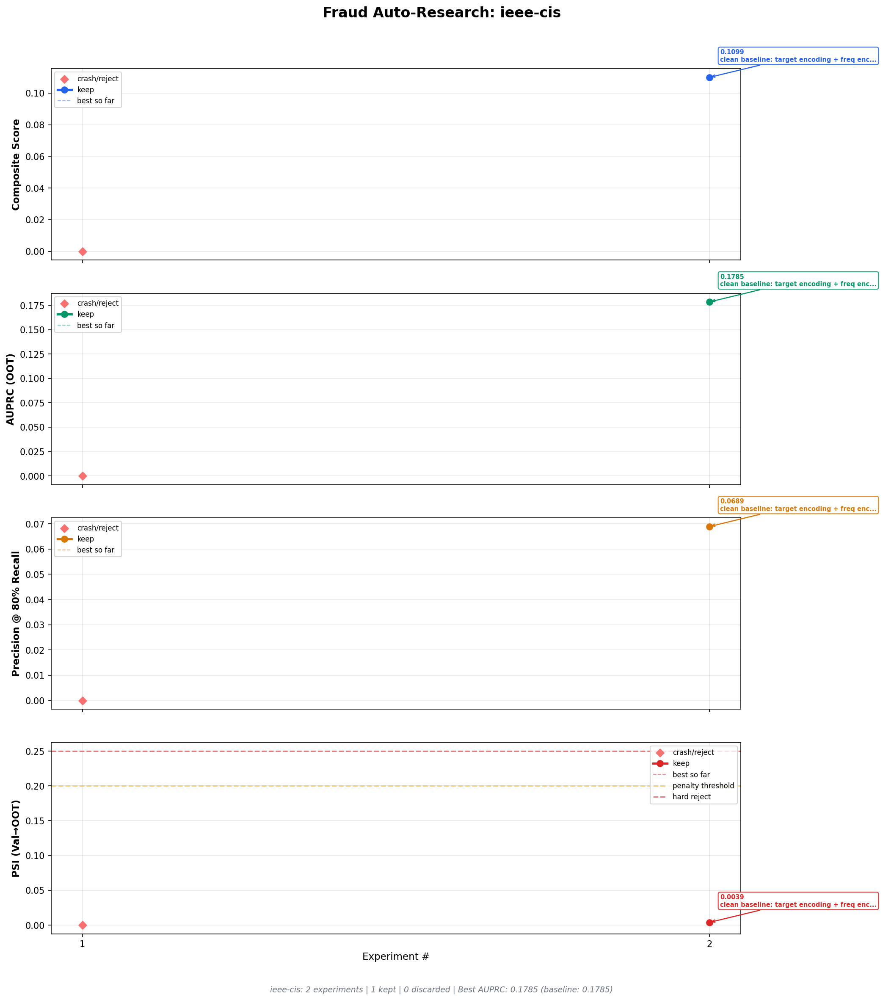
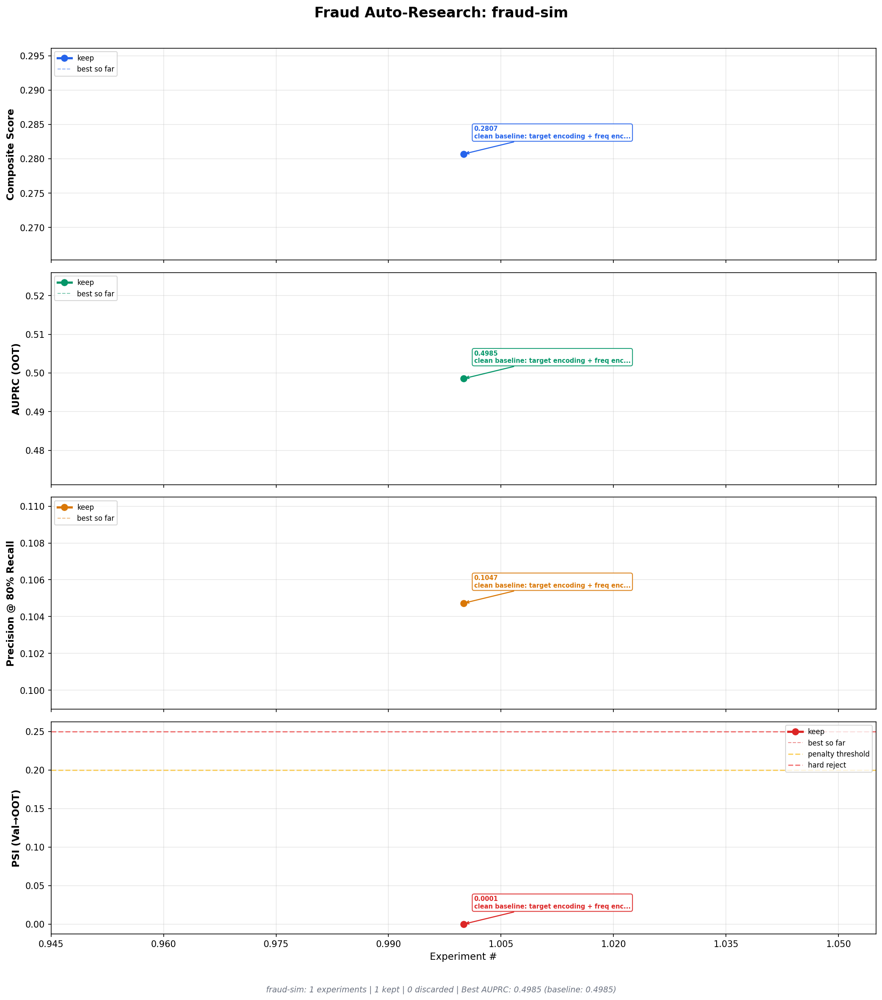

# fraud-auto-research

Autonomous feature engineering and model evaluation for transaction fraud monitoring, inspired by [Karpathy's autoresearch](https://github.com/karpathy/autoresearch). An LLM agent proposes hypotheses, implements features, evaluates results, and iterates — the harness just keeps score.

---

## Two-Phase Design

This system separates **setup** (done once by a human) from **iteration** (done autonomously by the agent):

### Phase 1 — Human Setup (done once per problem)

The operator adapts the system to a specific fraud problem:

1. **Prepare data** — split into train/val/OOT parquet files with a `label` column
2. **Write a config** (`configs/my-dataset.yaml`) — specifies data paths, date splits, metric thresholds, and a `dataset_profile` that tells the agent what columns are available and what fraud type it's dealing with
3. **Write baseline feature/model files** — minimal `features_{dataset}.py` and `model_{dataset}.py` that pass validation
4. **Update `recipes.md`** — add domain-specific feature patterns the agent can reference
5. **Update `program.md`** if needed — the agent's instruction file with domain context and strategy guidance

**The harness (`harness/`) is never modified.** It is the fixed measurement apparatus. The agent is explicitly told not to touch it.

### Phase 2 — Agent Iteration (runs overnight, autonomously)

The agent loops:

```
LOOP FOREVER:
  1. Read experiment context (SOTA, technique success rates, untried approaches)
  2. Propose hypothesis ("merchant x category amount corridor features")
  3. Edit features_{dataset}.py and/or model_{dataset}.py
  4. Run: python3 -m harness.evaluate --config configs/{dataset}.yaml \
           --save --hypothesis "your hypothesis"
  5. Harness evaluates, auto-determines keep/discard vs SOTA, saves snapshot
  6. Read top_features, auprc_ci, status — inform next iteration
```

Each iteration is 30–180 seconds (GPU-accelerated). The agent runs 40+ experiments per session with no human involvement.

---

## Project Structure

```
fraud-auto-research/
│
├── program.md              # Agent instruction file — scope, loop, anti-patterns
├── recipes.md              # Feature engineering patterns (copy-paste fit/transform code)
├── fraud_practices.md      # SOTA fraud knowledge bank — datasets, fraud types, feature recipes
│
├── configs/
│   ├── ieee-cis.yaml       # IEEE-CIS config + dataset_profile
│   └── fraud-sim.yaml      # Fraud-sim config + dataset_profile
│
├── features_ieee.py        # AGENT-EDITABLE — IEEE-CIS feature transforms
├── features_sim.py         # AGENT-EDITABLE — fraud-sim feature transforms
├── model_ieee.py           # AGENT-EDITABLE — IEEE-CIS model definition
├── model_sim.py            # AGENT-EDITABLE — fraud-sim model definition
│
├── harness/                # READ-ONLY — the fixed measurement apparatus
│   ├── evaluate.py         # Pipeline: load → fit → transform → validate → train → metrics
│   ├── experiment_tracker.py  # Directory-per-experiment, SOTA symlinks, index.jsonl
│   ├── context.py          # Agent memory: SOTA, history, success rates, recommendations
│   ├── dashboard.py        # Self-contained HTML dashboard (plots embedded as base64)
│   ├── plot_results.py     # Per-dataset annotated metric plots
│   ├── data_loader.py      # Parquet loading, train/val/OOT splitting
│   ├── validate_features.py   # NaN rates, schema alignment, count limits, string checks
│   ├── feature_analysis.py    # IV, PSI per feature, correlation matrix
│   └── utils.py            # Config loader, GPU detection, file hashing
│
├── experiments/            # Auto-generated — never committed
│   └── ieee-cis/
│       ├── exp_000_.../
│       │   ├── features.py   # Code snapshot
│       │   ├── model.py      # Code snapshot
│       │   ├── metrics.json  # AUPRC, precision, PSI, CIs, feature importances
│       │   ├── state.json    # Fitted state dict (deployable artifact)
│       │   └── metadata.json # Hypothesis, status, timestamp, parent
│       ├── index.jsonl       # Append-only log
│       └── sota -> exp_NNN_  # Symlink to current best
│
├── data/                   # Source parquet files (not in repo)
│   ├── raw_train.parquet
│   ├── raw_val.parquet
│   ├── raw_oot.parquet
│   └── fraud-sim/
│       └── raw_{train,val,oot}.parquet
│
├── reports/                # Auto-generated after each experiment
│   ├── dashboard.html      # Self-contained (no server needed, works via file://)
│   ├── plot_ieee-cis.png
│   └── plot_fraud-sim.png
│
└── docs/                   # Static docs assets
    ├── plot_ieee-cis_baseline.png
    └── plot_fraud-sim_baseline.png
```

---

## Key Design Decisions

### Leakage-safe fit/transform API

The agent implements two functions per dataset:

```python
def fit(df_train: pd.DataFrame, y_train: pd.Series, config: dict) -> dict:
    """Called ONCE on training data WITH labels.
    Compute target encodings, frequency stats, group medians here.
    Return a plain JSON-serializable dict — no sklearn objects."""

def transform(df: pd.DataFrame, state: dict, config: dict) -> pd.DataFrame:
    """Called on EACH split WITHOUT labels.
    Apply the fitted state from fit(). Never access labels here."""
```

The harness strips labels before calling `transform()`. A leakage detector flags any feature with single-feature AUC > 0.90. The state dict must be JSON-serializable (plain dicts/lists/numbers) so it can be deployed independently.

### Composite score

```
composite_score = 0.50 × AUPRC + 0.30 × Precision@Recall(80%) − 0.20 × PSI_penalty
```

AUPRC on the OOT holdout is the primary metric. Precision at 80% recall captures operating-point performance. PSI (Population Stability Index) between val and OOT score distributions penalizes instability — hard-reject at PSI ≥ 0.25.

### Experiment tracking without git

Every experiment — kept or discarded — is saved as a directory with code snapshots, metrics, and fitted state. A `sota` symlink always points to the current best. No git operations needed during the loop; nothing is ever lost.

### Structured agent context

After every `--save` run, the harness prints:

```
SOTA: exp_011 — AUPRC=0.6089, Composite=0.3966
  Top features: mc_amt_ratio_median=0.19, mc_amt_zscore=0.13 ...

Technique success rates:
  behavioral     2/5 kept (40%)
  amount_patterns  2/3 kept (67%)

Untried: anomaly, geo_features, velocity, interaction_te ...

Warning: 3-experiment discard streak — try a different category.
```

This is the agent's memory. It prevents repeating failed approaches and surfaces untried territory automatically.

---

## Included Datasets

### IEEE-CIS Fraud Detection

590K card-not-present transactions from the [Vesta Corporation IEEE-CIS Kaggle competition](https://www.kaggle.com/c/ieee-fraud-detection). The original V1–V339, C1–C14, D1–D15, and M1–M9 derived features are stripped — the agent starts from 55 raw columns: transaction amount, card info, addresses, email domains, device/identity fields, and M-fields (boolean match flags). 3.5% fraud rate, stable OOT.

### Fraud-Sim

1.8M simulated credit card transactions from [Sparkov simulation](https://www.kaggle.com/datasets/kartik2112/fraud-detection). 16 raw columns: merchant, category, amount, geographic coordinates, demographics. 0.5% fraud rate with a 42% population shift in OOT (fraud rate drops 0.58% → 0.33%) — a challenging test for model stability. Reward for PSI-safe features.

---

## Example: Clean Baseline Run

Starting from a clean baseline (target encoding + frequency encoding + basic amount/time features):

### IEEE-CIS



| # | Status | AUPRC | Hypothesis |
|---|--------|-------|------------|
| 0 | crash | — | first attempt (string columns not encoded — fixed) |
| 1 | **keep** | **0.178** | clean baseline: TE + freq encoding + amount/time |

Baseline AUPRC 0.178. Published ceiling with full derived features: ~0.50.

### Fraud-Sim



| # | Status | AUPRC | Hypothesis |
|---|--------|-------|------------|
| 0 | **keep** | **0.499** | clean baseline: TE + freq encoding + behavioral amount deviations |

Baseline AUPRC 0.499. Strong starting point — behavioral amount deviation features (merchant/category/gender z-scores) carry significant signal even in the baseline.

---

## Adapting to a New Dataset

### 1. Prepare data

```
data/my-dataset/
├── raw_train.parquet   # label col = 0/1
├── raw_val.parquet
└── raw_oot.parquet
```

### 2. Create config (`configs/my-dataset.yaml`)

```yaml
dataset_name: "my-dataset"
features_file: "features_mydataset.py"
model_file: "model_mydataset.py"

local_data:
  enabled: true
  data_dir: "./data/my-dataset"
  prefix: "raw"

metrics:
  target_recall: 0.80
  composite_weights:
    auprc: 0.50
    precision_at_recall: 0.30
    psi_penalty: 0.20
  psi_threshold: 0.20
  psi_hard_reject: 0.25
  min_improvement: 0.001

dataset_profile:
  fraud_rate: 0.01
  n_rows: 500000
  n_raw_features: 30
  has_geo: false
  has_identity: true
  population_shift: low
  key_entity_col: "card_id"
  # ... guide the agent's strategy
```

### 3. Write baseline files

**`features_mydataset.py`** — encode categoricals, handle NaNs:

```python
def fit(df_train, y_train, config):
    state = {"global_mean": float(y_train.mean())}
    # frequency encode all string columns
    cat_cols = df_train.select_dtypes("object").columns.tolist()
    state["cat_cols"] = cat_cols
    for col in cat_cols:
        freq = df_train[col].value_counts(normalize=True).to_dict()
        state[f"{col}_freq"] = {str(k): float(v) for k, v in freq.items()}
    # drop high-NaN columns
    nan_rates = df_train.isnull().mean()
    state["drop_cols"] = nan_rates[nan_rates > 0.5].index.tolist()
    return state

def transform(df, state, config):
    df = df.copy().drop(columns=state["drop_cols"], errors="ignore")
    for col in state["cat_cols"]:
        if col in df.columns:
            df[f"{col}_freq"] = df[col].map(state[f"{col}_freq"]).fillna(0)
            df = df.drop(columns=[col])
    return df.fillna(-1)
```

**`model_mydataset.py`** — GPU auto-detected:

```python
import xgboost as xgb
from harness.utils import get_gpu_info

def train_and_evaluate(X_train, y_train, X_val, y_val, X_oot, y_oot, config):
    gpu = get_gpu_info()
    pos, neg = y_train.sum(), len(y_train) - y_train.sum()
    model = xgb.XGBClassifier(
        n_estimators=1000, max_depth=6, learning_rate=0.05,
        scale_pos_weight=neg/pos,
        tree_method=gpu["tree_method"], device=gpu["device"],
        eval_metric="aucpr", early_stopping_rounds=50, random_state=42,
    )
    model.fit(X_train, y_train, eval_set=[(X_val, y_val)], verbose=False)
    return {
        "y_val_pred": model.predict_proba(X_val)[:, 1],
        "y_oot_pred": model.predict_proba(X_oot)[:, 1],
        "model": model, "train_info": {},
    }
```

### 4. Seed and run

```bash
# Establish baseline
python3 -m harness.evaluate --config configs/my-dataset.yaml \
    --save --hypothesis "baseline"

# View what the agent sees
python3 -m harness.context my-dataset

# Open dashboard
python3 -m harness.dashboard --open
```

### 5. Launch the agent

Point Claude Code or Cursor at `program.md` with the dataset config. The agent reads `program.md`, the config, `recipes.md`, `fraud_practices.md`, and the current experiment context — then loops until told to stop.

---

## Adapting to a New Domain

The harness is domain-agnostic — only the config, feature files, model files, `recipes.md`, and `program.md` are domain-specific.

| What to change | What stays the same |
|----------------|---------------------|
| `configs/*.yaml` — data paths, metric weights, domain profile | `harness/evaluate.py` — pipeline orchestration |
| `features_*.py` — domain-specific transforms | `harness/experiment_tracker.py` — tracking |
| `model_*.py` — algorithm choices | `harness/context.py` — agent memory |
| `recipes.md` — domain feature patterns | `harness/dashboard.py` — dashboard |
| `program.md` — agent strategy guidance | `harness/data_loader.py`, `validate_features.py`, etc. |
| `fraud_practices.md` → `domain_practices.md` | All metric computation |

The composite score formula is fully configurable via YAML weights. If you need a different primary metric (e.g., log loss, Gini, custom threshold metric), modify `evaluate.py` — it's the one harness file designed to be customized for new domains.

---

## Running the Agent

```bash
# Install
pip install -e .

# Single evaluation
python3 -m harness.evaluate --config configs/ieee-cis.yaml \
    --save --hypothesis "add velocity features"

# View experiment history
python3 -m harness.experiment_tracker ieee-cis

# View agent context
python3 -m harness.context ieee-cis

# Regenerate dashboard (self-contained HTML, works via file://)
python3 -m harness.dashboard --open
```

The system runs two datasets in parallel by assigning each a separate `features_*.py` and `model_*.py` file, so agents don't conflict on shared state.

---

## Dependencies

- Python 3.10+
- `pandas`, `numpy`, `scikit-learn`, `xgboost`, `matplotlib`, `pyarrow`, `pyyaml`
- Optional: `google-cloud-bigquery` (for BQ data sources), `lightgbm`, `scipy`
- GPU: CUDA GPU auto-detected for XGBoost (`tree_method=hist, device=cuda`)
